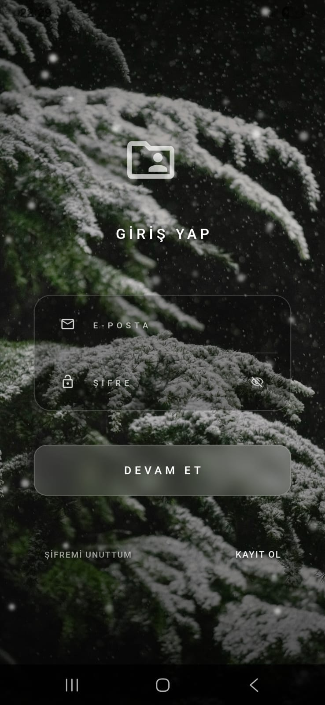
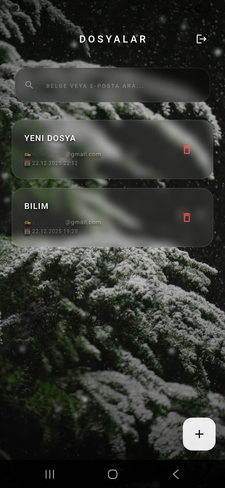
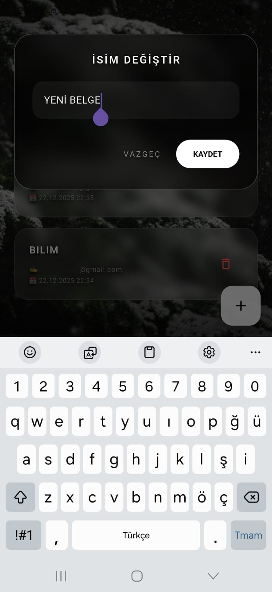
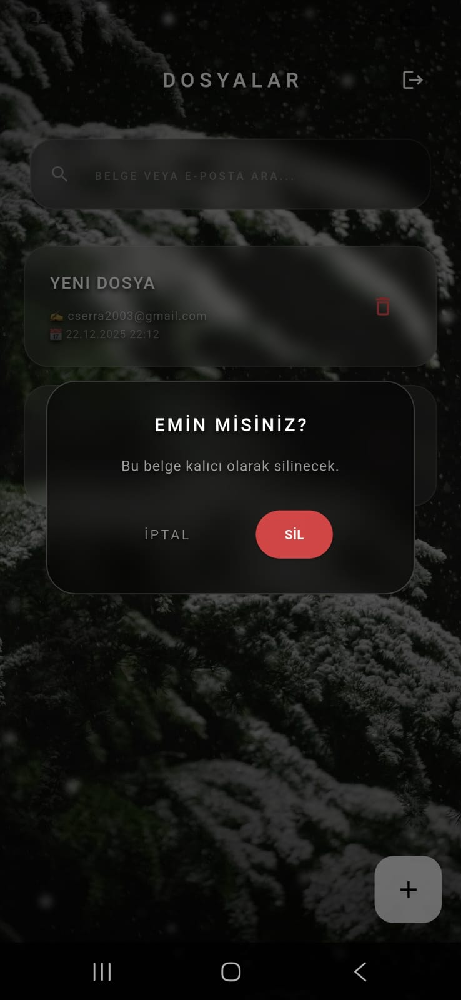
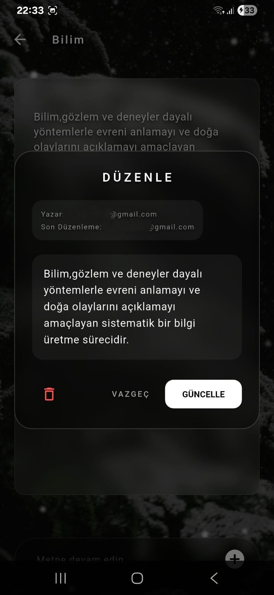
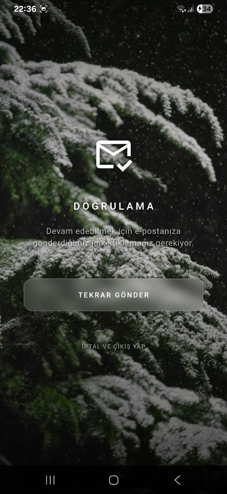
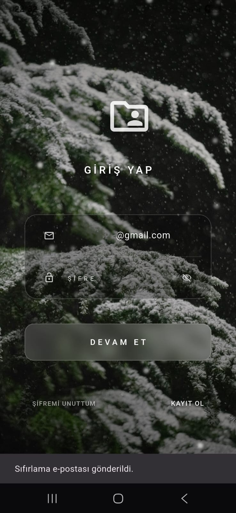
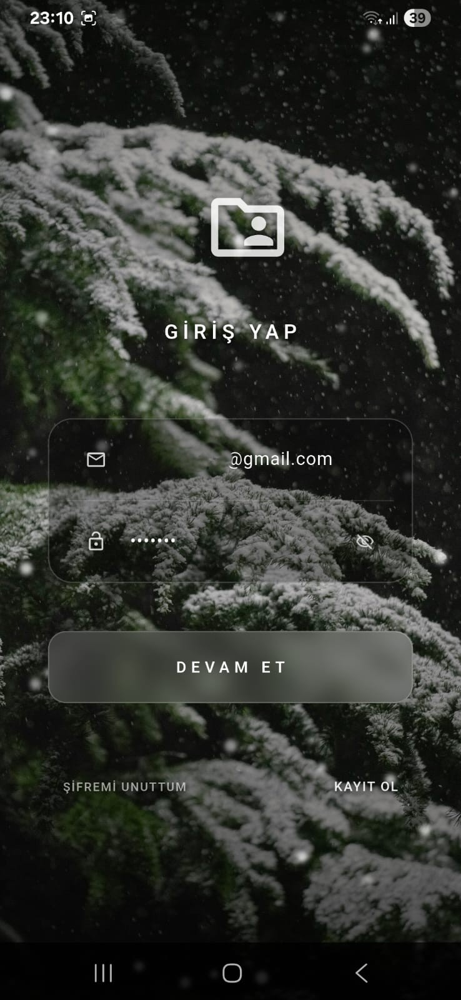

# document-management-mobile-app
# Belge Yönetimi Mobil Uygulaması

Bu proje, kullanıcıların belgelerini dijital ortamda oluşturabilmesini, görüntüleyebilmesini ve silebilmesini sağlayan bir mobil uygulamadır.

Uygulama arayüzünde arka planda kar yağışı animasyonu ve doğa temalı bir görsel kullanılmıştır. Dosya ve klasör ikonları, kullanıcı etkileşimine bağlı olarak hareketli şekilde tasarlanmıştır.

## Özellikler
- Kullanıcı girişi ve kayıt işlemleri
- Belge oluşturma
- Belge listeleme
- Belge silme
- Animasyonlu arka plan (kar yağışı)
- Etkileşimli klasör simgeleri

## Kullanılan Teknolojiler
- Flutter
- Firebase Authentication
- Firebase Firestore

## Proje Dokümantasyonu

Uygulamanın çalışma mantığı ve teknik detayları aşağıdaki PDF dosyasında açıklanmıştır:

- 📄 [Proje Açıklaması](proje_aciklamasi2.pdf)

## Amaç
Bu projenin amacı, görsel olarak zenginleştirilmiş bir arayüz ile kullanıcı etkileşimini artıran ve temel belge yönetimi işlevlerini sunan bir mobil uygulama geliştirmektir.
## Ekran Görüntüleri

### Giriş

### Kayıt

### Dosya Listesi

### Dosya Detayı

### Dosya İsmi Değiştirme

### Dosya İşlemi Onayı

### Belge Düzenleme

### Detay Güncelleme

### E-posta Doğrulama

### Doğrulama Tekrar Gönder

### Şifre Sıfırlama Talebi

### Şifre Sıfırlama E-postası

### Şifre Görünür

### Şifre Gizli

